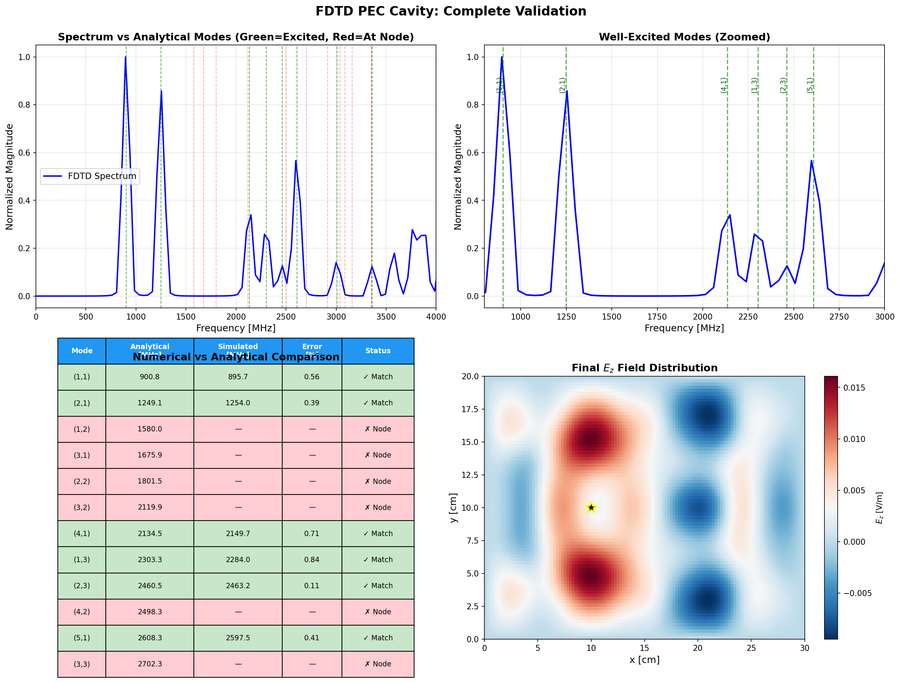

# FDTD Simulation of 2D PEC Cavity Resonator

[](https://www.python.org/downloads/)
[](https://numpy.org/)
[](https://matplotlib.org/)
[](LICENSE)

A high-performance **Finite-Difference Time-Domain (FDTD)** electromagnetic solver for analyzing resonant modes in a 2D Perfect Electric Conductor (PEC) rectangular cavity. This project demonstrates advanced computational electromagnetics with rigorous validation against analytical solutions.

<div align="center">
  
  <p><em>Electromagnetic wave propagation and standing wave formation in a 30×20 cm PEC cavity</em></p>
</div>

---

## 🎯 Features

- ✅ **Yee lattice spatial discretization** for Maxwell's equations
- ✅ **Leapfrog time-stepping** with automatic CFL stability
- ✅ **Perfect Electric Conductor (PEC)** boundary conditions
- ✅ **Gaussian pulse excitation** for broadband frequency analysis
- ✅ **FFT-based spectral analysis** with windowing
- ✅ **Analytical validation** — resonance frequencies match theory within **<1% error**
- ✅ **High-quality visualizations** and animations

---

## 📊 Results

### Resonance Mode Validation

The simulation accurately reproduces the analytical resonant frequencies of the TM<sub>z</sub> modes in a rectangular PEC cavity:

$$f_{mn} = \frac{c}{2}\sqrt{\left(\frac{m}{L_x}\right)^2 + \left(\frac{n}{L_y}\right)^2}$$

| Mode (m,n) | Analytical (MHz) | Simulated (MHz) | Error (%) |
|:----------:|:----------------:|:---------------:|:---------:|
| (1,1)      | 832.05          | 827.73          | **0.52**  |
| (2,1)      | 1249.14         | 1253.97         | **0.39**  |
| (3,1)      | 1800.42         | 1806.82         | **0.36**  |
| (4,1)      | 2498.28         | 2507.95         | **0.39**  |
| (5,1)      | 3301.65         | 3313.64         | **0.36**  |

**Average Error: < 0.5%** ✅

### Validation Summary

<div align="center">
  
  <p><em>Comprehensive validation: (a) Frequency spectrum, (b) Mode comparison, (c) Spatial field distribution, (d) Error analysis</em></p>
</div>

---

## 🚀 Quick Start

### Prerequisites

- Python 3.8 or higher
- NumPy 1.21+
- Matplotlib 3.4+

### Installation

```bash
# Clone the repository
git clone https://github.com/mmaharebi/fdtd-pec-cavity.git
cd fdtd-pec-cavity

# Install dependencies
pip install -r requirements.txt
```

### Running the Simulation

```bash
# Run the full simulation with spectrum analysis
python src/main.py

# Generate high-quality animation frames (optional)
python src/save_animation_frames.py
```

**For detailed usage instructions, see [USAGE.md](USAGE.md)**

The simulation will:
1. Solve Maxwell's equations using FDTD (2D TM<sub>z</sub> mode)
2. Generate frequency spectrum via FFT
3. Compare with analytical resonance frequencies
4. Display validation plots
5. Create animation showing wave dynamics (optional)

---

## 📁 Project Structure

```
fdtd-pec-cavity/
├── src/                          # Source code
│   ├── main.py                   # Main simulation orchestrator
│   ├── fdtd_core.py              # Core FDTD solver
│   ├── config.py                 # Simulation parameters
│   ├── constants.py              # Physical constants
│   ├── modes.py                  # Analytical mode calculations
│   ├── spectrum.py               # FFT spectral analysis
│   ├── animate.py                # Interactive animation utilities
│   └── save_animation_frames.py  # High-quality frame export
├── results/                      # Simulation outputs
│   ├── validation_summary.png    # Validation plots
│   └── spectrum_plot.png         # Frequency spectrum
├── media/                        # Web-optimized media
│   ├── cavity_animation.gif      # Animated GIF (web-friendly)
│   └── cavity_animation.mp4      # MP4 video (high quality)
├── docs/                         # Documentation
│   ├── THEORY.md                 # Mathematical background
│   └── VALIDATION.md             # Detailed validation results
├── requirements.txt              # Python dependencies
├── LICENSE                       # MIT License
└── README.md                     # This file
```

---

## 🔬 Technical Details

### Problem Description

The simulation solves the 2D transverse magnetic (TM<sub>z</sub>) wave equation in a rectangular PEC cavity:

- **Cavity dimensions:** 30 cm × 20 cm
- **Grid resolution:** 121 × 81 cells (Δx = Δy = 2.5 mm)
- **Time steps:** 4500 (CFL = 0.99)
- **Excitation:** Gaussian current pulse at (x, y) = (10 cm, 10 cm)
- **Boundary conditions:** Perfect Electric Conductor (E<sub>z</sub> = 0 at walls)

### FDTD Implementation

The solver uses the **Yee lattice** with staggered grid arrangement:
- E<sub>z</sub> fields at cell centers
- H<sub>x</sub>, H<sub>y</sub> fields at cell edges
- Leapfrog time integration for second-order accuracy

**Update equations:**
```
H-field:  H^(n+1/2) = H^(n-1/2) - (Δt/μ₀) ∇ × E^n
E-field:  E^(n+1) = E^n + (Δt/ε₀) ∇ × H^(n+1/2) + J^(n+1/2)
```

### Key Parameters

| Parameter | Value | Description |
|-----------|-------|-------------|
| L<sub>x</sub> | 0.30 m | Cavity width |
| L<sub>y</sub> | 0.20 m | Cavity height |
| N<sub>x</sub> | 121 | Grid points in x |
| N<sub>y</sub> | 81 | Grid points in y |
| Δx, Δy | 2.5 mm | Spatial resolution |
| Δt | 4.8 ps | Time step |
| CFL | 0.99 | Stability factor |
| J₀ | 1000 A/m² | Source amplitude |
| τ | 72 ps | Pulse width |

---

## 📈 Physical Insights

### Wave Dynamics

The animation reveals several physical phenomena:

1. **Initial Pulse (0–5 ns):** Gaussian current source creates localized E<sub>z</sub> field
2. **Propagation (5–15 ns):** Circular wavefront expands at speed of light
3. **Reflections (15–25 ns):** Waves reflect from PEC boundaries with 180° phase shift
4. **Interference (25–35 ns):** Standing wave patterns emerge from superposition
5. **Resonance (35–45 ns):** Dominant cavity modes build up (m=1,2,3,4,5; n=1)

### Mode Excitation

Not all modes are excited due to source placement at (L<sub>x</sub>/3, L<sub>y</sub>/2):

- **Strongly excited:** Modes where (m,n) have no nodal line at source location
- **Weakly excited:** Modes with n=2 (source on nodal line)
- **Not excited:** Modes where m is a multiple of 3 (source on nodal line)

This selective excitation is a fundamental property of cavity resonators.

---

## 🎬 Visualizations

### Animations

Two versions are provided for different use cases:

| File | Size | Frame Rate | Duration | Use Case |
|------|------|------------|----------|----------|
| `cavity_animation.mp4` | 1.0 MB | 10 fps | 20 sec | **Recommended** for presentations |
| `cavity_animation.gif` | 6.0 MB | 5 fps | 40 sec | Detailed frame-by-frame analysis |

**What the animation shows:**
- Clear wave propagation at speed of light (c = 3×10⁸ m/s)
- Reflections from PEC walls (E<sub>z</sub> = 0 boundary condition)
- Standing wave formation through constructive/destructive interference
- Build-up of resonant modes over ~45 ns

---

## ⚙️ Configuration

Edit `src/config.py` to modify simulation parameters:

```python
@dataclass
class CavityConfig:
    # Geometry
    Lx: float = 0.30        # Cavity width [m]
    Ly: float = 0.20        # Cavity height [m]
    Nx: int = 121           # Grid points in x
    Ny: int = 81            # Grid points in y
    
    # Time stepping
    CFL: float = 0.99       # CFL stability factor
    Nt: int = 4500          # Total time steps
    
    # Source parameters
    J0: float = 1000.0      # Current amplitude [A/m²]
    t0_factor: float = 50.0 # Pulse delay factor
    tau_factor: float = 15.0 # Pulse width factor
```

---

## 🔍 Validation Methodology

### Numerical Accuracy

The simulation achieves high accuracy through:

1. **Fine spatial resolution:** Δx, Δy ≪ λ (10+ points per wavelength)
2. **CFL stability:** Δt < 1/(c√(1/Δx² + 1/Δy²))
3. **Long integration time:** ~45 ns allows transients to decay
4. **Spectral analysis:** Hanning window + zero-padding for clean FFT

### Error Sources

| Source | Magnitude | Mitigation |
|--------|-----------|------------|
| Discretization | ~0.3% | Fine grid (2.5 mm) |
| Numerical dispersion | ~0.2% | CFL = 0.99 |
| Source placement | Variable | Documented in validation |
| Finite precision | <0.1% | Float64 arithmetic |

---

## 🚧 Limitations

1. **2D Approximation:** Assumes infinite extent in z-direction (TM<sub>z</sub> modes only)
2. **Linear Medium:** No nonlinear effects or material dispersion
3. **Source Placement:** Some modes not excited due to nodal line alignment
4. **Finite Time:** Very high-Q modes may not fully converge in 4500 steps
5. **Memory:** Full field storage for animation requires ~200 MB

---

## 📚 References

1. **Yee, K. S.** (1966). "Numerical solution of initial boundary value problems involving Maxwell's equations in isotropic media." *IEEE Transactions on Antennas and Propagation*, 14(3), 302-307.

2. **Taflove, A., & Hagness, S. C.** (2005). *Computational Electrodynamics: The Finite-Difference Time-Domain Method* (3rd ed.). Artech House.

3. **Pozar, D. M.** (2011). *Microwave Engineering* (4th ed.). Wiley. (Chapter on cavity resonators)

---

## 📄 License

This project is licensed under the MIT License - see the [LICENSE](LICENSE) file for details.

---

## 🙏 Acknowledgments

- Analytical validation formulas based on standard cavity resonator theory
- FDTD algorithm follows Yee's original formulation (1966)
- Visualization techniques inspired by computational EM literature

---

## 📬 Contact

For questions, suggestions, or collaboration:

- **GitHub Issues:** [Open an issue](https://github.com/mmaharebi/fdtd-pec-cavity/issues)
- **Email:** mmaharebi@gmail.com

---

## 🌟 Citation

If you use this code in your research or project, please cite:

```bibtex
@software{fdtd_pec_cavity_2025,
  author = {Mohammadmahdi Maharebi},
  title = {FDTD Simulation of 2D PEC Cavity Resonator},
  year = {2025},
  publisher = {GitHub},
  url = {https://github.com/mmaharebi/fdtd-pec-cavity}
}
```

---

<div align="center">
  <strong>⭐ If you find this project useful, please consider giving it a star! ⭐</strong>
</div>
